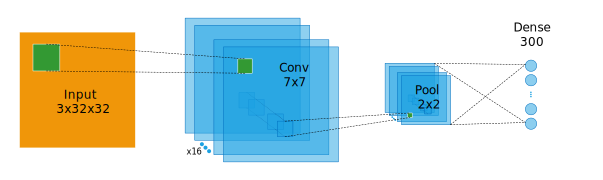

:mod:`nolearn.lasagne`
----------------------

Two introductory tutorials exist for *nolearn.lasagne*:

- `Using convolutional neural nets to detect facial keypoints tutorial
  <http://danielnouri.org/notes/2014/12/17/using-convolutional-neural-nets-to-detect-facial-keypoints-tutorial/>`_
  with `code <https://github.com/dnouri/kfkd-tutorial>`_

- `Training convolutional neural networks with nolearn
  <http://nbviewer.ipython.org/github/dnouri/nolearn/blob/master/docs/notebooks/CNN_tutorial.ipynb>`_
  
For specifics around classes and functions out of the *lasagne*
package, such as layers, updates, and nonlinearities, you'll want to
look at the `Lasagne project's documentation
<http://lasagne.readthedocs.org/>`_.

*nolearn.lasagne* comes with a `number of tests
<https://github.com/dnouri/nolearn/tree/master/nolearn/lasagne/tests>`_
that demonstrate some of the more advanced features, such as networks
with merge layers, and networks with multiple inputs.

Finally, there's a few presentations and examples from around the web.
Note that some of these might need a specific version of nolearn and
Lasange to run:

- Oliver Dürr's `Convolutional Neural Nets II Hands On
  <https://home.zhaw.ch/~dueo/bbs/files/ConvNets_24_April.pdf>`_ with
  `code <https://github.com/oduerr/dl_tutorial/tree/master/lasagne>`_

- Roelof Pieters' presentation `Python for Image Understanding
  <http://www.slideshare.net/roelofp/python-for-image-understanding-deep-learning-with-convolutional-neural-nets>`_
  comes with nolearn.lasagne code examples

- Benjamin Bossan's `Otto Group Product Classification Challenge
  using nolearn/lasagne
  <https://github.com/ottogroup/kaggle/blob/master/Otto_Group_Competition.ipynb>`_

- Kaggle's `instructions on how to set up an AWS GPU instance to run
  nolearn.lasagne
  <https://www.kaggle.com/c/facial-keypoints-detection/details/deep-learning-tutorial>`_
  and the facial keypoint detection tutorial

- `An example convolutional autoencoder
  <https://github.com/mikesj-public/convolutional_autoencoder/blob/master/mnist_conv_autoencode.ipynb>`_

- Winners of the saliency prediction task in the 2015 `LSUN Challenge
  <http://lsun.cs.princeton.edu/>`_ have published their
  `lasagne/nolearn-based code
  <https://imatge.upc.edu/web/resources/end-end-convolutional-networks-saliency-prediction-software>`_.

.. _layer-def:

Neural Network Layer Definition
~~~~~~~~~~~~~~~~~~~~~~~~~~~~~~~
There are two supported methods of providing a Layer Definition to the :class:`.NeuralNet` constructor.
The first involve generating the stack of :mod:`lasagne.layer` instances directly, while the second passes a dictionary
and relies on the NeuralNet constructor to instantiate the layers.

The sample network below is given as an example

Passing a Layer Instance Directly
=================================
The newer method is to simply set up a stack of layer instances, and pass the output layer to the constructor.
This method is more versatile, and supports all types of :mod:`lasagne.layers`

.. code-block:: python

     from lasagne import layers

     l_input = layers.InputLayer(shape=(None, 3, 32, 32), name="input")
     l_conv = layers.Conv2DLayer(l_input, num_filters=16, filter_size=7, pad="same", stride=1, name="conv")
     l_pool = layers.MaxPool2dLayer(l_conv, pool_size=2, stride=2, name="pool")
     l_dense = layers.DenseLayer(l_pool, num_units=300, name="dense")

    net = NeuralNet(layers=l_dense)

Passing a dictionary of LayerTypes
==================================
The second method involves creating a diction where the key is the layer name, and the value is the layer type.

Additional parameters are passed to the layer constructors by prepending the parameter name with the layer name,
and passing it as a kwarg to the NeuralNet.

The dictionary method is less versatile, and is unable to accommodate some of the newer lasagne features.

.. code-block:: python

     from lasagne import layers

     layer_dict = {"input": layers.InputLayer,
                   "conv": layers.Conv2DLayer,
                   "pool": layers.MaxPool2DLayer,
                   "dense": layers.DenseLayer}

     layer_kwargs = {"input_shape": (None, 3, 32, 32),
                     "conv_filter_size": 7,
                     "conv_pad": "same",
                     "conv_stride": 1,
                     "conv_num_filters": 16,
                     "pool_pool_size": 2,
                     "pool_stride": 2,
                     "num_units": 300}

     net = NeuralNet(layers=layer_dict, **layer_kwargs)

.. note:: The `layer_dict` value is a layer type, **not** an instance of the layer type.

API
~~~

.. automodule:: nolearn.lasagne

  .. autoclass:: NeuralNet(self, layers, **kwargs)
     :members:

     .. automethod:: __init__(self, layers, **kwargs)

  .. autoclass:: BatchIterator
     :members:

  .. autoclass:: TrainSplit
     :members:

